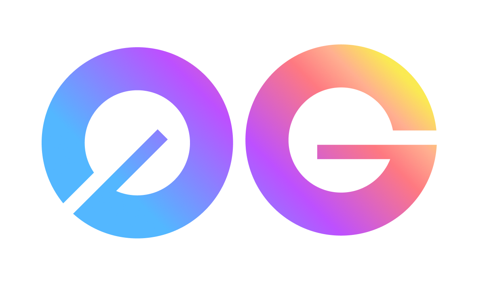

# 0g Labs

import MainpageMetrics from '@site/src/components/MainpageMetrics';

<MainpageMetrics rpc="https://og-testnet-rpc.itrocket.net" binary="0gchaind" />

[Og Labs](https://0g.ai) –  is a Layer-1 blockchain that provides a modular infrastructure for Web3.

ZeroGravity (0g) is the first data availability system with a built-in general purpose storage layer that is super scalable and decentralized. The scalability of 0G hinges on the idea of separating the workflow of data availability into data publishing lane and data storage lane. Large volume of data transfers happen on the data storage lane that is supported by the storage layer which achieves the horizontal scalability through well designed partitioning, while the data publishing lane guarantees the data availability property through consensus of data availability sampling which only requires tiny data flowing through the consensus protocol to avoid the broadcasting bottleneck. Data storage is an integral part of data availability because it must answer the question of where the data is published.



[Website](https://0g.ai) | [Blog](https://blog.0g.ai) | [GitHub](https://docs.0g.ai/0g-doc) | [Twitter](ehttps://twitter.com/0G_labs) | [Discord](https://discord.com/invite/0glabs) | [Docs](https://docs.0g.ai/0g-doc/docs/0g-da)

```mdx-code-block
import DocCardList from '@theme/DocCardList';

<DocCardList />
```