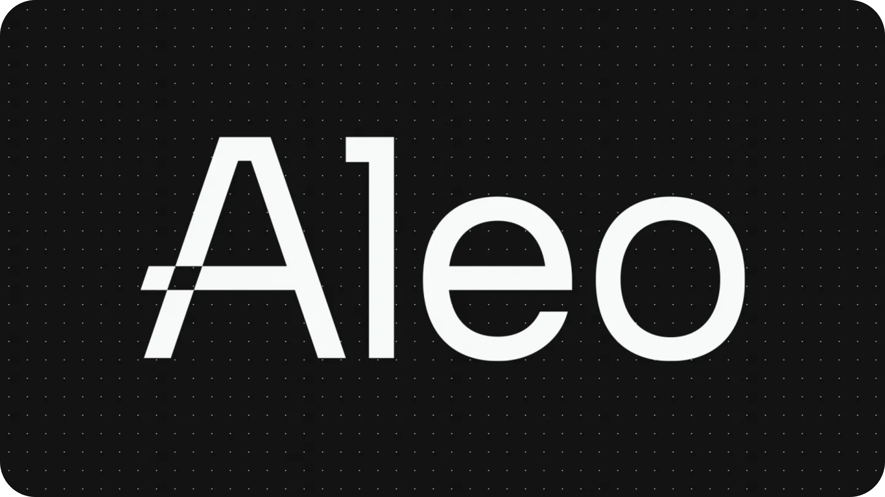

# Aleo

import Mainpage from '@site/src/components/Aleo';

<Mainpage />

[Aleo](https://aleo.org/) is a privacy-focused, zero-knowledge Layer 1 blockchain that combines Zero-Knowledge (ZK) cryptography with programmable smart contracts. With built-in cryptographic proofs called ZK-SNARKs, Aleo allows for hidden but verifiable activity and private transactions. This technological blend provides a robust foundation for secure online transactions and enables developers to build applications prioritizing user data privacy.

As Brennen Schlueter, Head of Marketing at Aleo, articulates, ZK-proofs tackle not only Web3 challenges but also broader internet security and privacy issues.



[Website](https://aleo.org/) | [Blog](https://aleo.org/blog/) | [GitHub](https://github.com/AleoHQ) | [Twitter](https://twitter.com/AleoHQ) | [Discord](https://discord.com/invite/aleohq) | [Docs](https://developer.aleo.org/)

```mdx-code-block
import DocCardList from '@theme/DocCardList';

<DocCardList />
```
