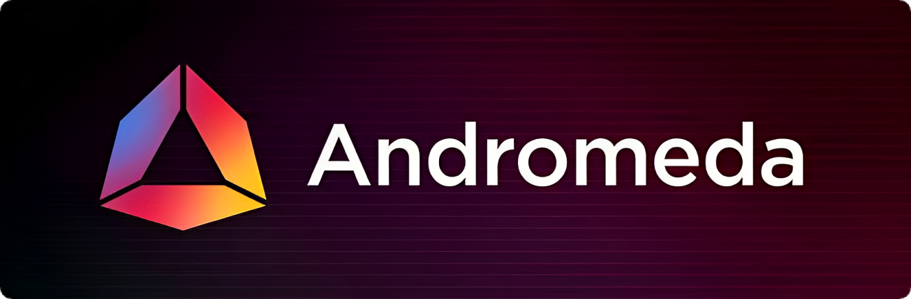

# Andromeda

import MainpageMetrics from '@site/src/components/MainpageMetrics';

<MainpageMetrics rpc="https://rpc.cosmos.directory/andromeda" binary="andromedad" />

[Andromeda](https://www.andromedaprotocol.io) –  is a Layer-1 blockchain that rapid development framework and a next-generation user interface that brings an Easier, Better, and Faster capability to Web 3.0, and the blockchain industry.

In short, a blockchain operating system provides an environment filled with ready to use tooling, common interfaces for applications and features familiar to modern computer users. As Andromeda is the first true operating system designed to run on distributed computing frameworks, the details are quite technical.
AndromedaOS, or aOS for short, is comprised of several interoperating systems that work together to bring clarity and ease of use to the user.

The power and performance of the Rust/CosmWasm combo is what allowed this breakthrough in interoperability and complexity.



[Website](https://www.andromedaprotocol.io/) | [Blog](https://medium.com/andromeda-engineering) | [GitHub](https://twitter.com/andromedaprot) | [Twitter](https://twitter.com/andromedaprot) | [Discord](https://discord.com/invite/GBd6buKYyZ) | [Docs](https://docs.andromedaprotocol.io)

```mdx-code-block
import DocCardList from '@theme/DocCardList';

<DocCardList />
```