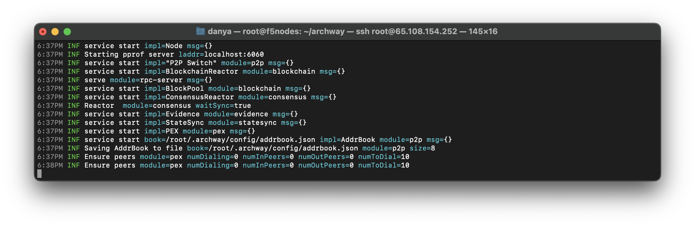

# Update

## Update the node

### Stop the node

```bash 
sudo systemctl restart archwayd 
```

### Upgrade to the latest version

```bash 
cd archway
git fetch
git checkout v0.4.0
make build
```

:::info
Check the latest archway-node version [here.](https://github.com/archway-network/archway/releases)
:::

### Start the node

```bash 
sudo systemctl enable archwayd 
sudo systemctl start archwayd
```

### Check logs

```bash 
journalctl -u archwayd -f -o cat
```


