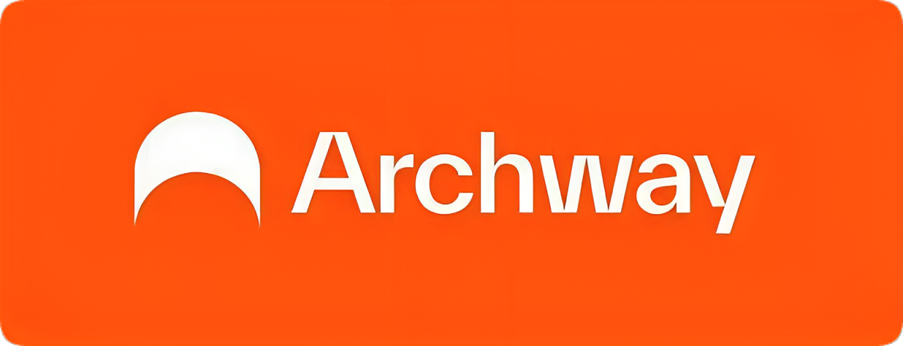

# Archway 

import MainpageMetrics from '@site/src/components/MainpageMetrics';

<MainpageMetrics rpc="https://rpc-archway.imperator.co" binary="archwayd" />

[Archway](https://archway.io/) is designed to reward developers and builders for the value they contribute to the protocol.

- Archway is a smart contract chain within the Cosmos ecosystem that rewards developers for building scalable cross-chain dapps. It's easy to use - just deploy your contracts to the established Proof-of-Stake network for a fast and low-cost experience.
- Archway is built for flexible smart contract development and hassle-free deployment to Cosmos. With contract libraries, the Archway CLI, and the GO CosmWasm SDK available, developers can easily build and deploy their projects.
- Archway is a great platform for developers looking for a simple and rewarding way to build scalable cross-chain dapps and deploy them to the Cosmos network.



[Website](https://archway.io/) | [Blog](https://blog.archway.io/) | [GitHub](https://github.com/archway-network) | [Twitter](https://twitter.com/archwayhq) | [Discord](https://discord.gg/5FVvx3WGfa) | [Docs](https://docs.archway.io/) | [Whitepaper](https://archway.io/lightpaper)

```mdx-code-block
import DocCardList from '@theme/DocCardList';

<DocCardList />
```