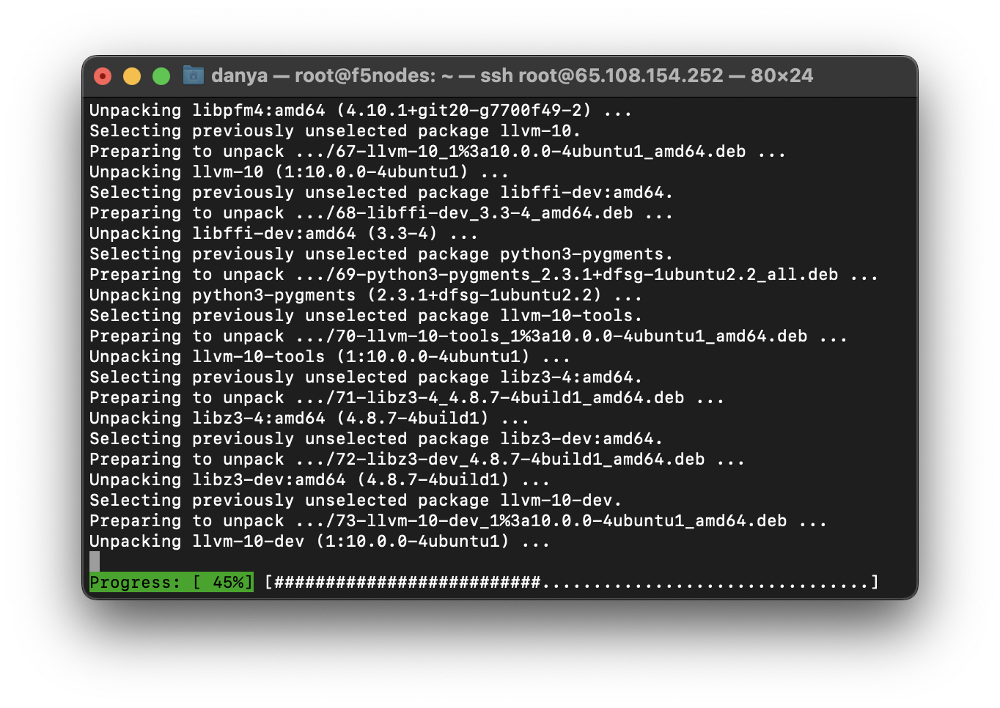
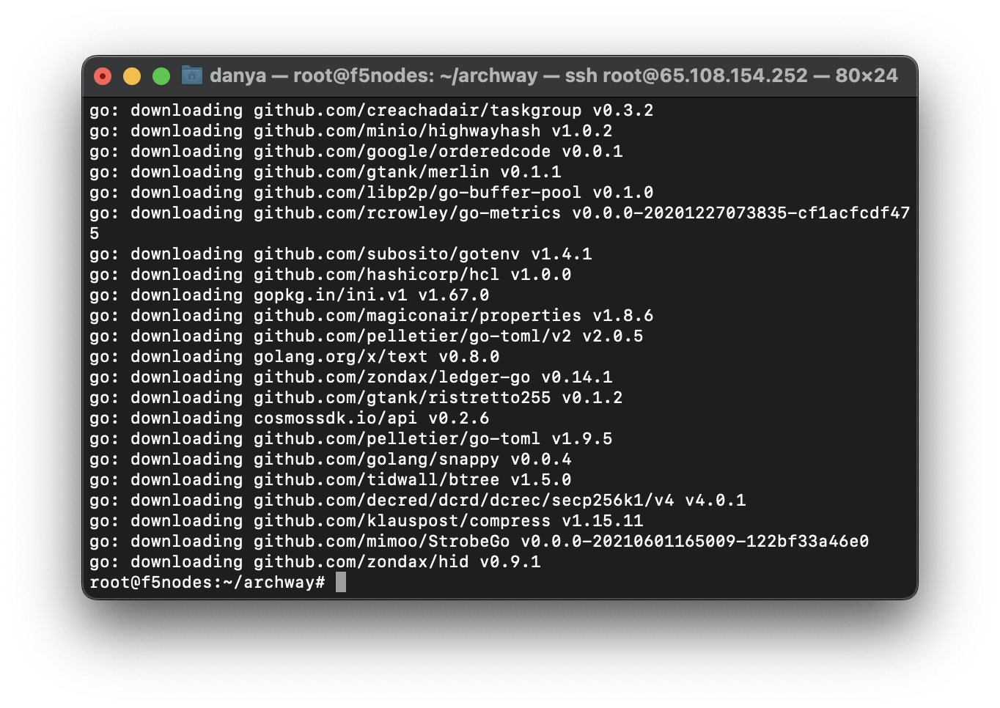
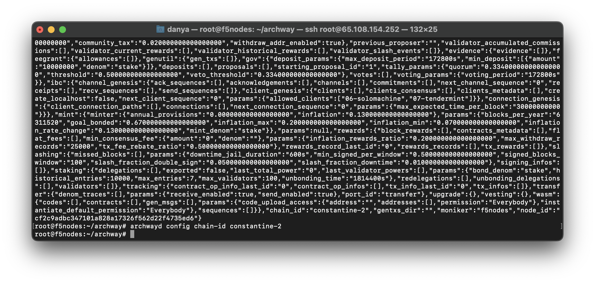
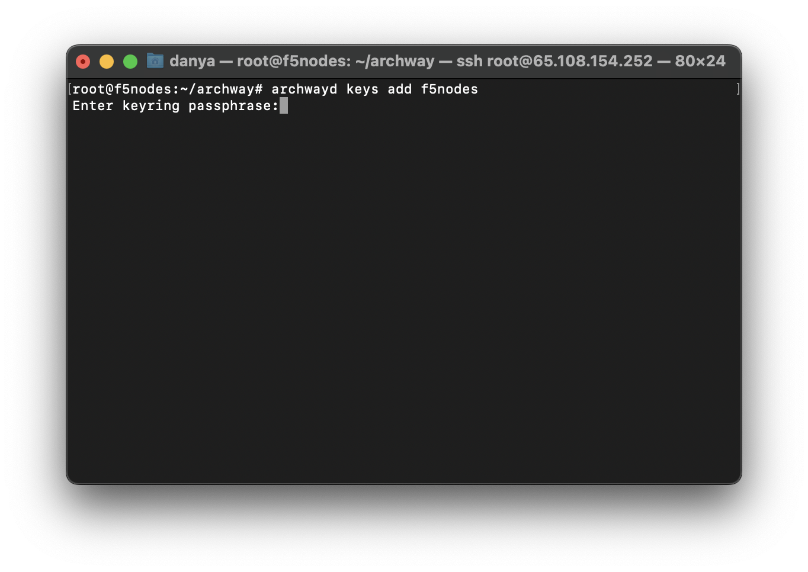
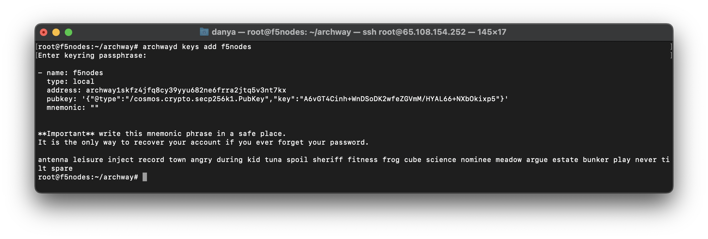
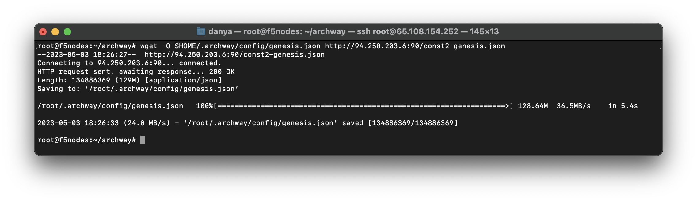
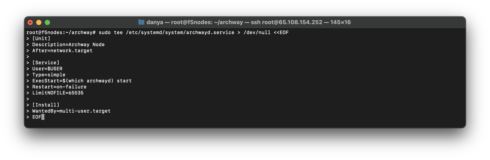
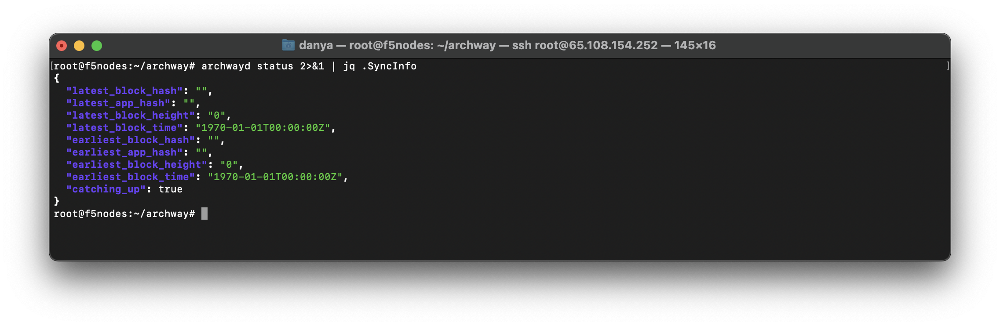

## Hardware requirements

- Memory: **16 GB RAM**
- CPU: **8 Core**
- Disk: **500 GB SSD Storage**

## Setting up Archway Validator node

### Server preparing

```bash
sudo apt update && sudo apt upgrade -y && \
sudo apt install curl tar wget clang pkg-config libssl-dev libleveldb-dev jq build-essential bsdmainutils git make ncdu htop screen unzip bc fail2ban htop -y
```



### Install Go

```bash
ver="1.20.3" && \
wget "https://golang.org/dl/go$ver.linux-amd64.tar.gz" && \
sudo rm -rf /usr/local/go && \
sudo tar -C /usr/local -xzf "go$ver.linux-amd64.tar.gz" && \
rm "go$ver.linux-amd64.tar.gz" && \
echo "export PATH=$PATH:/usr/local/go/bin:$HOME/go/bin" >> $HOME/.bash_profile && \
source $HOME/.bash_profile && \
```

### Check Go version

```bash
go version
```

### Download the binary file

```bash
cd $HOME
git clone https://github.com/archway-network/archway.git
cd archway
git checkout v0.4.0
make install
```



### Initialize node

:::note
Change `f5nodes` to yours one.
:::
```bash
archwayd init f5nodes --chain-id constantine-2
archwayd config chain-id constantine-2
```




### Create wallet for node

:::note
Change `f5nodes` to yours one.
:::
- Create a new key
```bash
archwayd keys add f5nodes
```





- Restore an existing key using a mnemonic (optional)
```bash
archwayd keys add f5nodes --recover
```

### Download genesis

```bash 
wget -O $HOME/.archway/config/genesis.json http://94.250.203.6:90/const2-genesis.json
```



### Download addrbook

```bash 
wget -qO $HOME/.archway/config/addrbook.json http://94.250.203.6:90/constantine-2.addr.json
```

### Create a service file

```bash 
sudo tee /etc/systemd/system/archwayd.service > /dev/null <<EOF
[Unit]
Description=Archway Node
After=network.target

[Service]
User=$USER
Type=simple
ExecStart=$(which archwayd) start
Restart=on-failure
LimitNOFILE=65535

[Install]
WantedBy=multi-user.target
EOF
```




### Start the node 

```bash
sudo systemctl daemon-reload && \
sudo systemctl enable archwayd && \
sudo systemctl restart archwayd && \
sudo journalctl -u archwayd -f -o cat
```


### Then go to [#faucet](https://discord.com/invite/5FVvx3WGfa) channel and request test tokens in format

```bash
!faucet <archway155sz8......>
```

### Check the synchronization

```bash 
archwayd status 2>&1 | jq .SyncInfo
```



:::note
If the value is `false`, you can proceed to the next step.
:::

### Create a validator

```bash
archwayd tx staking create-validator \
  --amount=1000000uconst \
  --pubkey=$(archwayd tendermint show-validator) \
  --moniker=$MONIKER \
  --chain-id=constantine-2 \
  --commission-rate="0.10" \
  --commission-max-rate="0.20" \
  --commission-max-change-rate="0.01" \
  --min-self-delegation=1000000 \
  --fees=200uconst \
  --from=$WALLET \
  --identity=$IDENTITY \
  --website=$WEBSITE \
  --details=$DETAILS \
  -y
```


## Useful commands

### Check node info 

```bash 
archwayd status 2>&1 | jq .NodeInfo
```

### Check synchronization

```bash 
archwayd status 2>&1 | jq .SyncInfo
```

### Check logs

```bash
journalctl -u archwayd -f -o cat
```

### Check balance

```bash 
archwayd q bank balances archway155...nnmq6
```

### Voting

```bash 
archwayd tx gov vote <PROPOSAL_ID> <yes|no> --from $WALLET --fees 200uconst -y
```

### Unjail

```bash 
archwayd tx slashing unjail --from $WALLET --fees 200uconst
```

### Delegate tokens

```bash 
archwayd tx staking delegate $VALOPER <TOKENS_COUNT>uconst--from $WALLET --fees 200uconst -y
```

### Undelegate tokens

```bash 
archwayd tx staking unbond $VALOPER <TOKENS_COUNT>uconst --from $WALLET --fees 200uconst -y
```

### Send tokens

```bash 
archwayd tx bank send $WALLET <WALLET_TO> <TOKENS_COUNT>uconst --fees 200uconst --gas autonibid status 2>&1 | jq .SyncInfo
```

### Delete a node

```bash 
sudo systemctl stop archwayd && \
sudo systemctl disable archwayd && \
rm /etc/systemd/system/archwayd.service && \
sudo systemctl daemon-reload && \
cd $HOME && \
rm -rf .archwayd && \
rm -rf archwayd && \
rm -rf $(which archwayd)
```
