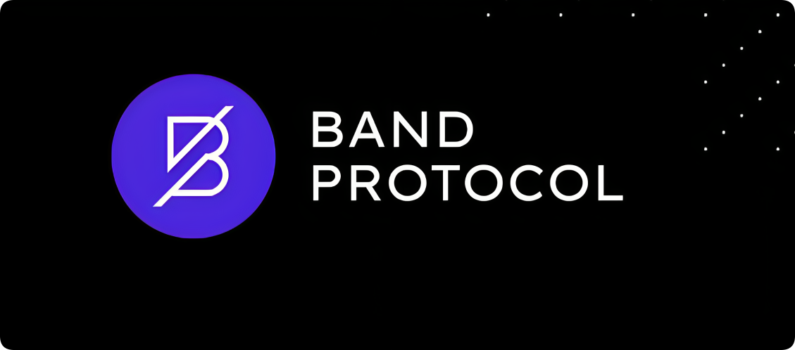

# Band Protocol

import MainpageMetrics from '@site/src/components/MainpageMetrics';

<MainpageMetrics rpc="http://rpc.laozi1.bandchain.org" binary="bandd" />

[Band Protocol](https://www.bandprotocol.com/) – is a cross-chain data oracle platform that aggregates and connects real-world data and APIs to smart contracts.

Blockchains are great at providing immutable storage and deterministic verifiable computations. However, they cannot access trusted real-world information available outside their networks. Band Protocol enhances smart contract functionalities by granting access to reliable data without any central authority or points of failure.



[Website](https://www.bandprotocol.com/) | [Blog](https://blog.bandprotocol.com/) | [GitHub](https://github.com/bandprotocol/chain) | [Twitter](https://twitter.com/BandProtocol) | [Discord](https://discord.com/invite/3t4bsY7) | [Docs](https://docs.bandchain.org/)

```mdx-code-block
import DocCardList from '@theme/DocCardList';

<DocCardList />
```
