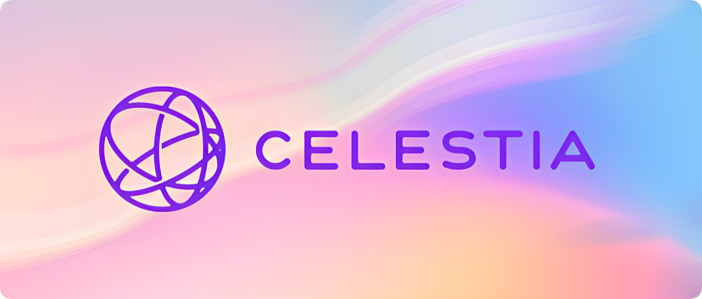

# Celestia

import MainpageMetrics from '@site/src/components/MainpageMetrics';

<MainpageMetrics rpc="https://celestia-rpc.publicnode.com" binary="celestia-appd" />

[Celestia](https://celestia.org/) – is a first modular blockchain network that securely scales with the number of users, making it easy for anyone to launch their own blockchain.

Celestia scales by decoupling execution from consensus and introducing a new primitive, data availability sampling.

It is allows sovereign blockchains to break free from the constraints of monolithic architectures so that they can build with flexibility and freedom on their own terms. Celestia has no smart contract features; it only orders data and checks to see if it is available. This is because smart contracts are only necessary for blockchains where applications will live. This decoupling of features alleviates some of the largest problems that hold back blockchains from scaling.




[Website](https://celestia.org/) | [Blog](https://blog.celestia.org/) | [GitHub](https://github.com/CelestiaOrg) | [Twitter](https://twitter.com/CelestiaOrg) | [Discord](https://discord.com/invite/YsnTPcSfWQ) | [Docs](https://docs.celestia.org/)

```mdx-code-block
import DocCardList from '@theme/DocCardList';

<DocCardList />
```
