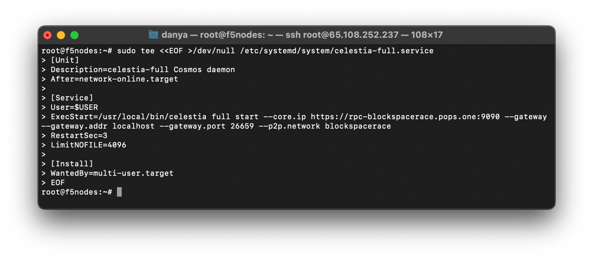
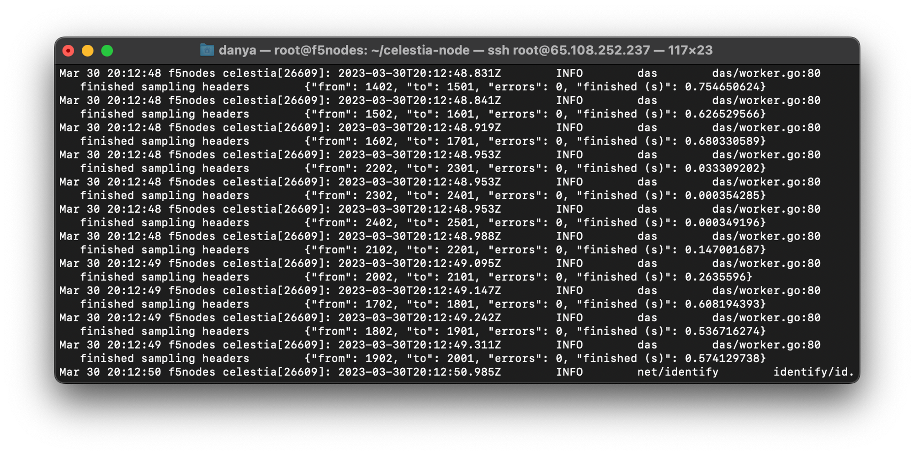

# Full Storage Node

## Hardware requirements

- Memory: 8 GB RAM
- CPU: Quad-Core
- Disk: 1 TB SSD Storage
- Bandwidth: 1 Gbps for Download/1 Gbps for Upload

## Setting up full storage node

### Server preparing

```bash
sudo apt -q update
sudo apt -qy install curl git jq lz4 build-essential
sudo apt -qy upgrade
```


### Install Go

```bash
ver="1.20.2" 
cd $HOME 
wget "https://golang.org/dl/go$ver.linux-amd64.tar.gz" 
sudo rm -rf /usr/local/go 
sudo tar -C /usr/local -xzf "go$ver.linux-amd64.tar.gz" 
rm "go$ver.linux-amd64.tar.gz"
echo "export PATH=$PATH:/usr/local/go/bin:$HOME/go/bin" >> $HOME/.bash_profile
source $HOME/.bash_profile
```


### Check Go version

```bash
go version
```
You should see output like:


### Download the binary file

```bash
cd $HOME 
rm -rf celestia-node 
git clone https://github.com/celestiaorg/celestia-node.git 
cd celestia-node/ 
git checkout tags/v0.8.0 
make build 
make install 
make cel-key
```


### Check Celestia version

```bash
celestia version
```

:::info
Check the latest celestia-node version [here](https://github.com/celestiaorg/celestia-node/releases)
:::

### Create key for node 

:::note
Change `f5nodes` to your moniker 
:::
- Create a new key
```bash
./cel-key add f5nodes --keyring-backend test --node.type full --p2p.network blockspacerace
```


- Restore an existing key using a mnemonic (optional)
```bash
./cel-key add f5nodes --keyring-backend test --node.type full --p2p.network blockspacerace --recover
```

Then we can go to [#faucet](https://discord.com/invite/YsnTPcSfWQ) channel for “Blockspace Race” and request test tokens in format: 
```bash
$request <celestia1ux3y......> 
```

### Initialize Full node

:::note
Change `f5nodes` to your moniker 
:::

```bash
celestia full init \
  --keyring.accname f5nodes \
  --p2p.network blockspacerace
```


### Create a service file 

```bash 
sudo tee <<EOF >/dev/null /etc/systemd/system/celestia-full.service
[Unit]
Description=celestia-full Cosmos daemon
After=network-online.target

[Service]
User=$USER
ExecStart=/usr/local/bin/celestia full start --core.ip https://rpc-blockspacerace.pops.one:9090 --gateway --gateway.addr localhost --gateway.port 26659 --p2p.network blockspacerace
RestartSec=3
LimitNOFILE=4096

[Install]
WantedBy=multi-user.target
EOF
```



### Start the node

```bash 
sudo systemctl enable celestia-full
sudo systemctl start celestia-full && sudo journalctl -u celestia-full.service -f
```



## Useful commands

### Check wallet
```bash
cd celestia-node
./cel-key list --node.type full --keyring-backend test --p2p.network blockspacerace
```

### Check wallet balance
```bash
curl -X GET http://127.0.0.1:26659/balance
```

### Get full node ID
```bash
AUTH_TOKEN=$(celestia full auth admin --p2p.network blockspacerace)
curl -X POST \
     -H "Authorization: Bearer $AUTH_TOKEN" \
     -H 'Content-Type: application/json' \
     -d '{"jsonrpc":"2.0","id":0,"method":"p2p.Info","params":[]}' \
     http://localhost:26658
```

### Check logs
```bash
sudo journalctl -u celestia-full.service -f
```

### Submitting a PayForData transaction
```bash
curl -X POST -d '{"namespace_id": "0c204d39600fddd3",
  "data": "f1f20ca8007e910a3bf8b2e61da0f26bca07ef78717a6ea54165f5",
  "gas_limit": 80000, "fee": 2000}' http://localhost:26659/submit_pfd
```

### Delete node
```bash
cd $HOME
sudo systemctl stop celestia-full
sudo systemctl disable celestia-full
sudo rm /etc/systemd/system/celestia-full.service
sudo systemctl daemon-reload
rm -f $(which celestia-full)
rm -rf $HOME/.celestia-full
rm -rf $HOME/celestia-full
```


