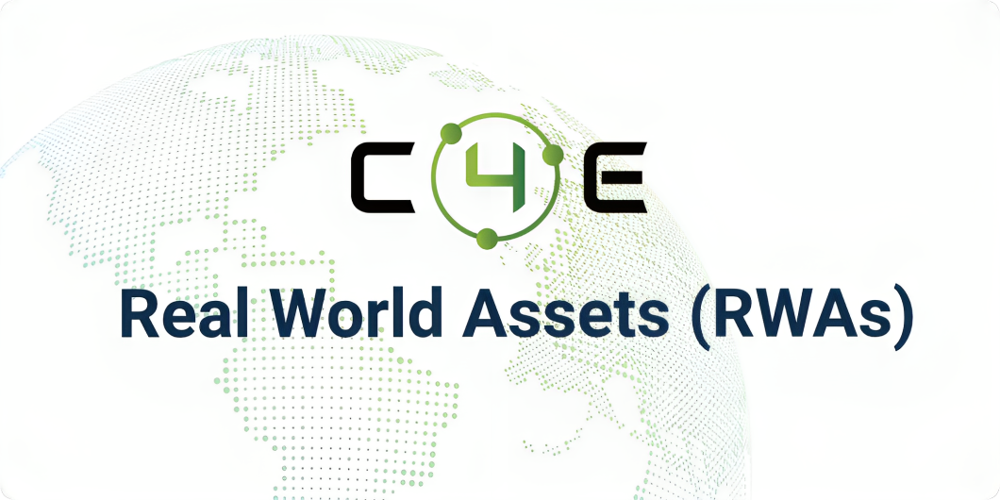

# Chain4Energy

import MainpageMetrics from '@site/src/components/MainpageMetrics';

<MainpageMetrics rpc="https://rpc.cosmos.directory/chain4energy" binary="c4ed" />

[C4E](https://c4e.io/) is a modular Layer-1 blockchain that based on Cosmos SDK. 

Chain4Energy brings the energy industry to Webnp3 by responding to the requirements and needs of all participants and enabling the effective creation and distribution of value. Blockchain removes delays, gets the right information to the right place, and eliminates the possibility of fraud and manipulation. It also enables P2P energy trading (without intermediaries), and thus effectively, between energy market participants.

C4E’s mission is to build a solution for the energy sector to accelerate the transition towards NET ZERO emission through the use of blockchain and distributed ledger technologies

[Website](https://c4e.io) | [Blog](https://medium.com/chain4-energy) | [Twitter](https://twitter.com/Chain4Energy) | [Discord](https://discord.com/invite/chain4energy) | [GitHub](https://github.com/chain4energy) | [Linkedin](https://www.linkedin.com/company/chain4energy/) | [Docs](https://docs.c4e.io)



```mdx-code-block
import DocCardList from '@theme/DocCardList';

<DocCardList />
```