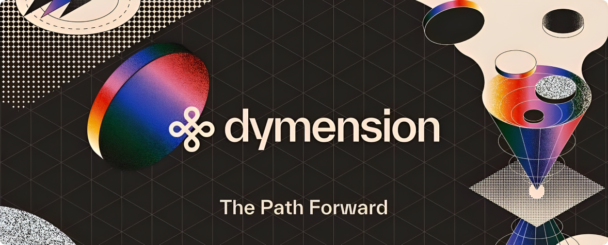

# Dymension

import MainpageMetrics from '@site/src/components/MainpageMetrics';

<MainpageMetrics rpc="https://dymension-testnet-rpc.polkachu.com/" binary="dymd" />

[Dymension](https://dymension.xyz/) is a modular blockchain built for RollApps, or application-specific rollups. The protocol has two main functions:
- acting as a settlement layer for RollApps;
- providing a RollApp Development Kit (RDK), a pre-packaged set of generic modules that enable a simple process for building and deploying permission-less RollApps.



[Website](https://dymension.xyz/) | [Blog](https://medium.com/@dymension) | [GitHub](https://github.com/dymensionxyz) | [Twitter](https://twitter.com/dymension) | [Discord](https://discord.gg/dymension) | [Docs](https://docs.dymension.xyz/)

```mdx-code-block
import DocCardList from '@theme/DocCardList';

<DocCardList />
```
