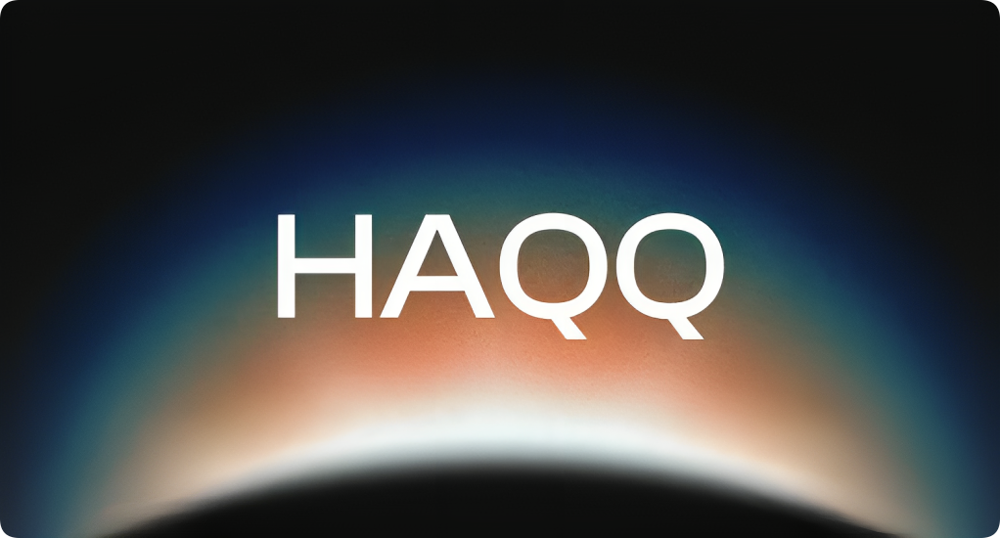

# Haqq Network

import MainpageMetrics from '@site/src/components/MainpageMetrics';

<MainpageMetrics rpc="https://haqq-rpc.publicnode.com:443" binary="haqqd" />

[Haqq Network](https://haqq.network/) – ethics-first network that welcomes sustainability-centered developers, validators and open source contributors as well as Muslim innovators in sustainable Finance.

Haqq is a scalable, high-throughput Proof-of-Stake blockchain that is fully compatible and interoperable with Ethereum. It's built using the Cosmos SDK (opens new window) which runs on top of Tendermint Core (opens new window) consensus engine.



[Website](https://haqq.network/) | [Blog](https://haqq.network/blog) | [GitHub](https://github.com/haqq-network) | [Twitter](https://twitter.com/The_HaqqNetwork) | [Discord](https://discord.gg/islamiccoin) | [Docs](https://docs.haqq.network)

```mdx-code-block
import DocCardList from '@theme/DocCardList';

<DocCardList />
```
