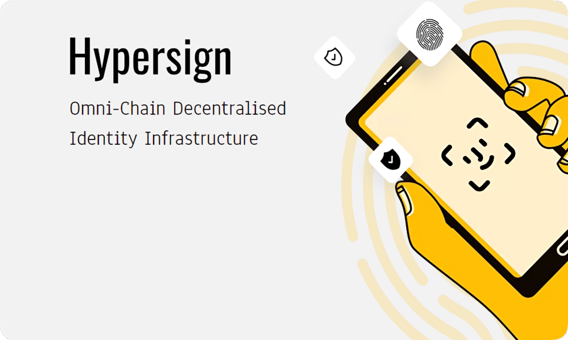

# Hypersign

import MainpageMetrics from '@site/src/components/MainpageMetrics';

<MainpageMetrics rpc="https://hid.rpc.t.stavr.tech" binary="hid-noded" />

[Hypersign](https://www.hypersign.id) is a permissionless blockchain network to manage digital identity and access rights. 

It aims to empower humans to gain control of their data and access on the internet by providing scalable, interoperable and secure verifiable data registry (VDR) to implement use cases on Self Sovereign Identity (SSI) principles.



[Website](https://www.hypersign.id) | [Blog](https://medium.com/hypersign) | [GitHub](https://github.com/hypersign-protocol) | [Twitter](https://twitter.com/hypersignchain) | [Discord](https://discord.com/invite/MMnhBYjF4N) | [Docs](https://docs.hypersign.id)

```mdx-code-block
import DocCardList from '@theme/DocCardList';

<DocCardList />
```