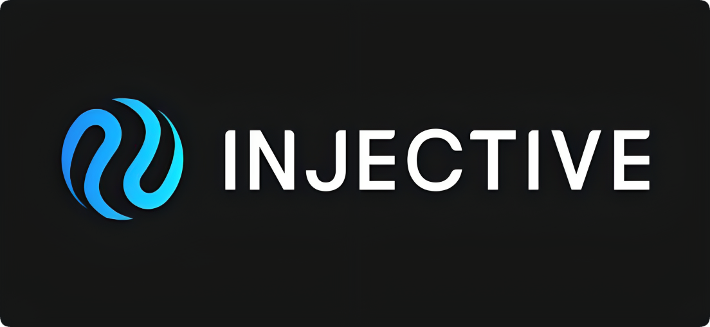

# Injective

import MainpageMetrics from '@site/src/components/MainpageMetrics';

<MainpageMetrics rpc="https://rpc-injective.imperator.co" binary="injectived" />

[Injective](https://injective.com) is a Layer 1 blockchain that built using the Cosmos SDK, where developers can find robust out-of-the-box modules such as a completely decentralized orderbook that can be utilized to build a diverse array of sophisticated applications.

- Injective is natively interoperable across a number of sovereign blockchain networks while also being IBC-enabled. Injective is able to facilitate seamless cross-chain transactions across Ethereum, Moonbeam, IBC-enabled chains such as CosmosHub, and Wormhole integrated chains such as Solana, Avalanche, and many more.
- Injective supports CosmWasm, a novel smart contracting platform built for the Cosmos ecosystem. This means developers can easily launch their own smart-contract powered applications on Injective. Smart-contracts that work on other chains supporting CosmWasm can seamlessly be migrated to Injective.
- Since Injective supports cross-chain transactions with Ethereum and all IBC-enabled chains, it means tokens launched on Injective can be exposed to multiple networks by default.
- Injective utilize flexible and expressive development environments powered by Rust and Golang.



[Website](https://injective.com/) | [Blog](https://blog.injective.com) | [GitHub](https://github.com/InjectiveLabs) | [Twitter](https://twitter.com/Injective_) | [Discord](https://discord.com/invite/NK4qdbv) | [Docs](https://docs.injective.network/)

```mdx-code-block
import DocCardList from '@theme/DocCardList';

<DocCardList />
```
