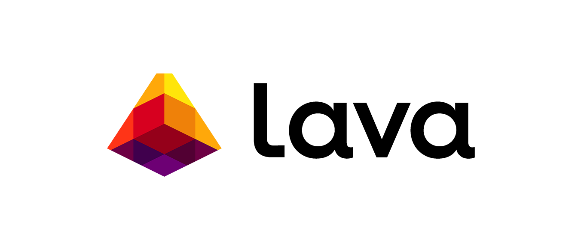

# Lava Network

import MainpageMetrics from '@site/src/components/MainpageMetrics';

<MainpageMetrics rpc="https://lava-rpc.f5nodes.com" binary="lavad" />

[Lava Network](https://www.lavanet.xyz/) is decentralizing access to blockchain data. It is the first truly unstoppable protocol for blockchain API access.

Serving as a two-sided marketplace that incentivizes and coordinates blockchain nodes to provide dapps with blockchain data, Lava is setting the standard for fast, reliable, and secure API at scale.



[Website](https://www.lavanet.xyz/) | [Blog](https://www.lavanet.xyz/blog) | [GitHub](https://github.com/lavanet) | [Twitter](https://twitter.com/lavanetxyz) | [Discord](https://discord.gg/Tbk5NxTCdA) | [Docs](https://docs.lavanet.xyz/)

```mdx-code-block
import DocCardList from '@theme/DocCardList';

<DocCardList />
```
