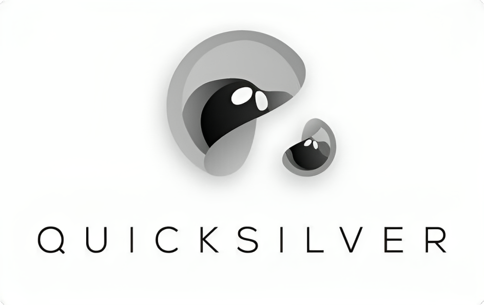

# Quicksilver

import MainpageMetrics from '@site/src/components/MainpageMetrics';

<MainpageMetrics rpc="https://rpc.cosmos.directory/quicksilver" binary="quicksilverd" />

[Quicksilver](https://quicksilver.zone) is a a Cosmos SDK-based Layer-1 blockchain. 

The Quicksilver Protocol allows delegators of proof-of-stake network stake assets against any validator running on IBC-enabled chains. In turn, delegators receive derivative vouchers representative of their staking positions. Built using the Cosmos SDK, Quicksilver provides Interchain Liquid Staking that scales to all validators across the network of IBC-connected chains while preserving users’ governance rights. It maximizes liquidity and capital efficiency while simultaneously improving network security and decentralization.



[Website](https://quicksilver.zone) | [Blog](https://medium.com/quicksilverzone) | [GitHub](https://github.com/ingenuity-build) | [Twitter](https://twitter.com/quicksilverzone) | [Discord](https://discord.com/invite/xrSmYMDVrQ) | [Docs](https://docs.quicksilver.zone/)

```mdx-code-block
import DocCardList from '@theme/DocCardList';

<DocCardList />
```