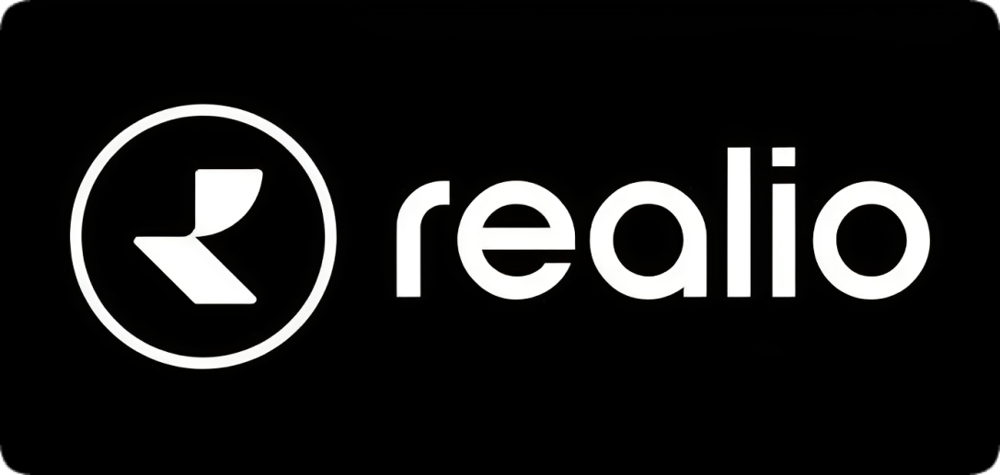

# Realio Network 

import MainpageMetrics from '@site/src/components/MainpageMetrics';

<MainpageMetrics rpc="https://rpc.cosmos.directory/realio" binary="realio-networkd" />

[Realio Network](https://realio.network) is a EVM-compatible Layer-1 blockchain, based on Cosmos SDK.

An interoperable multi-chain Web3 ecosystem focused on the issuance and management of digitally native real-world assets (RWAs). Its design is fully open-source, permissionless, and purpose-built.

Realio is a digital issuance, investment, and peer-to-peer trading platform that enables you to tokenize various assets like real estate investment trust (REIT). Realio also helps users to manage these token throughout their life cycles. Realio can be the shot in the arm that real estate needs. 



[Website](https://realio.network/) | [Blog](https://www.realio.fund/blog) | [GitHub](https://github.com/realiotech) | [Twitter](https://twitter.com/realio_network) | [Discord](https://discord.com/invite/Nv9EUbRnKb) | [Docs](https://docs.realio.network/)

```mdx-code-block
import DocCardList from '@theme/DocCardList';

<DocCardList />
```