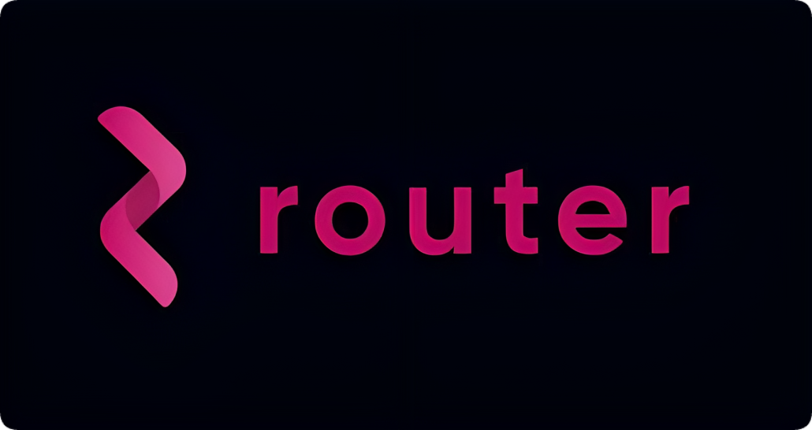

# Router Protocol

import MainpageMetrics from '@site/src/components/MainpageMetrics';

<MainpageMetrics rpc="https://rpc-t.router.nodestake.top" binary="routerd" />

[Router Protocol](https://www.routerprotocol.com/) – is a decentralized network built using the Cosmos SDK that that leverages Byzantine Fault Tolerant (BFT) consensus engine.

Router chain provides an innovative solution to the problem of blockchain interoperability. Apart from validating state changes on the Router chain, validators running on the Router chain can also monitor state changes on other chains.

Simply put, the Router architecture allows contracts on one chain to interact with contracts on other chains in a secure and decentralized manner.

Router uses Voyage, is a cross-chain swapping engine that allows for cross-chain asset transfers as well as cross-chain sequencing of asset transfers and arbitrary instruction transfers. 



[Website](https://www.routerprotocol.com/) | [Blog](https://routerprotocol.medium.com/) | [GitHub](https://github.com/router-protocol) | [Twitter](https://twitter.com/routerprotocol?t=Jab_H522Y2fB6uM60Pn6zA&s=09) | [Discord](https://discord.com/invite/rKf9UYMNWC) | [Docs](https://docs.routerprotocol.com/)

```mdx-code-block
import DocCardList from '@theme/DocCardList';

<DocCardList />
```