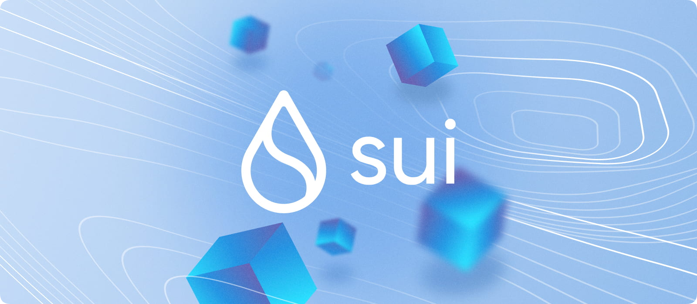

# Sui

import MainpageMetrics from '@site/src/components/MainpageMetrics';

🌐 Network: Sui Mainnet | 📟 Binary Name: suid 

[Sui](https://sui.io/) is an innovative, decentralized Layer 1 blockchain that redefines asset ownership.

To differentiate itself from other blockchains like Ethereum, Solana, and Polkadot, Sui introduces several architectural designs to increase its speed and scalability without sacrificing the blockchain’s security. These include the Sui consensus engine, parallel transaction execution and Sui’s Move smart contract programming language.



[Website](https://sui.io/) | [Blog](https://blog.sui.io/) | [GitHub](https://github.com/MystenLabs) | [Twitter](https://twitter.com/SuiNetwork) | [Discord](https://discord.gg/sui) | [Docs](https://docs.sui.io/)

```mdx-code-block
import DocCardList from '@theme/DocCardList';

<DocCardList />
```
